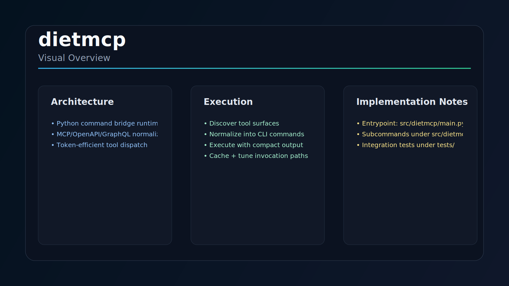

# dietmcp

MCP/OpenAPI/GraphQL to CLI bridge focused on token-efficient tool usage.

## Problem
Full schema injection is costly and brittle for long sessions.

## Reproducibility
```bash
pip install dietmcp
dietmcp --help
```

## Limits
Benefits depend on tool catalog and output distribution.

## Visual Overview



